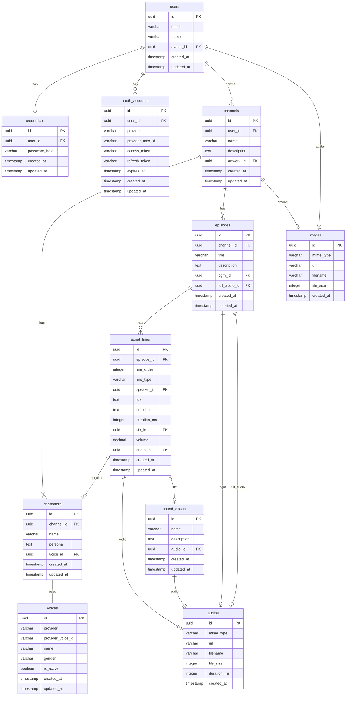

# Anycast データベース設計

## ER 図

---

## テーブル定義

### 認証テーブル

ユーザー認証に関するデータ。

---

#### users

ユーザー情報を管理する。

| カラム名 | 型 | NULLABLE | デフォルト | 説明 |
|----------|-----|:--------:|------------|------|
| id | UUID | | gen_random_uuid() | 主キー |
| email | VARCHAR(255) | | - | メールアドレス |
| name | VARCHAR(255) | | - | 表示名 |
| avatar_id | UUID | ◯ | - | アバター画像（images 参照） |
| created_at | TIMESTAMP | | CURRENT_TIMESTAMP | 作成日時 |
| updated_at | TIMESTAMP | | CURRENT_TIMESTAMP | 更新日時 |

**インデックス:**
- PRIMARY KEY (id)
- UNIQUE (email)

**外部キー:**
- avatar_id → images(id) ON DELETE SET NULL

---

#### credentials

パスワード認証情報を管理する。1 ユーザーにつき 1 レコード。

| カラム名 | 型 | NULLABLE | デフォルト | 説明 |
|----------|-----|:--------:|------------|------|
| id | UUID | | gen_random_uuid() | 主キー |
| user_id | UUID | | - | ユーザー（users 参照） |
| password_hash | VARCHAR(255) | | - | パスワードハッシュ（bcrypt） |
| created_at | TIMESTAMP | | CURRENT_TIMESTAMP | 作成日時 |
| updated_at | TIMESTAMP | | CURRENT_TIMESTAMP | 更新日時 |

**インデックス:**
- PRIMARY KEY (id)
- UNIQUE (user_id)

**外部キー:**
- user_id → users(id) ON DELETE CASCADE

---

#### oauth_accounts

OAuth 認証情報を管理する。1 ユーザーに複数の OAuth プロバイダを紐付け可能。

| カラム名 | 型 | NULLABLE | デフォルト | 説明 |
|----------|-----|:--------:|------------|------|
| id | UUID | | gen_random_uuid() | 主キー |
| user_id | UUID | | - | ユーザー（users 参照） |
| provider | VARCHAR(50) | | - | プロバイダ: `google` |
| provider_user_id | VARCHAR(255) | | - | プロバイダ側のユーザー ID |
| access_token | VARCHAR(1024) | ◯ | - | アクセストークン |
| refresh_token | VARCHAR(1024) | ◯ | - | リフレッシュトークン |
| expires_at | TIMESTAMP | ◯ | - | トークン有効期限 |
| created_at | TIMESTAMP | | CURRENT_TIMESTAMP | 作成日時 |
| updated_at | TIMESTAMP | | CURRENT_TIMESTAMP | 更新日時 |

**インデックス:**
- PRIMARY KEY (id)
- UNIQUE (provider, provider_user_id)
- INDEX (user_id)

**外部キー:**
- user_id → users(id) ON DELETE CASCADE

---

### ユーザーデータテーブル

ユーザーが作成・管理するデータ。

---

#### channels

チャンネル情報を管理する。

| カラム名 | 型 | NULLABLE | デフォルト | 説明 |
|----------|-----|:--------:|------------|------|
| id | UUID | | gen_random_uuid() | 主キー |
| user_id | UUID | | - | オーナー（users 参照） |
| name | VARCHAR(255) | | - | チャンネル名 |
| description | TEXT | ◯ | - | チャンネルの説明 |
| artwork_id | UUID | ◯ | - | カバー画像（images 参照） |
| created_at | TIMESTAMP | | CURRENT_TIMESTAMP | 作成日時 |
| updated_at | TIMESTAMP | | CURRENT_TIMESTAMP | 更新日時 |

**インデックス:**
- PRIMARY KEY (id)
- INDEX (user_id)

**外部キー:**
- user_id → users(id) ON DELETE CASCADE
- artwork_id → images(id) ON DELETE SET NULL

---

#### characters

チャンネルに登場するキャラクター情報を管理する。

| カラム名 | 型 | NULLABLE | デフォルト | 説明 |
|----------|-----|:--------:|------------|------|
| id | UUID | | gen_random_uuid() | 主キー |
| channel_id | UUID | | - | 所属チャンネル |
| name | VARCHAR(255) | | - | キャラクター名 |
| persona | TEXT | ◯ | - | キャラクター設定 |
| voice_id | UUID | | - | ボイス（voices 参照） |
| created_at | TIMESTAMP | | CURRENT_TIMESTAMP | 作成日時 |
| updated_at | TIMESTAMP | | CURRENT_TIMESTAMP | 更新日時 |

**インデックス:**
- PRIMARY KEY (id)
- UNIQUE (channel_id, name)
- INDEX (channel_id)

**外部キー:**
- channel_id → channels(id) ON DELETE CASCADE
- voice_id → voices(id) ON DELETE RESTRICT

---

#### episodes

エピソード情報を管理する。

| カラム名 | 型 | NULLABLE | デフォルト | 説明 |
|----------|-----|:--------:|------------|------|
| id | UUID | | gen_random_uuid() | 主キー |
| channel_id | UUID | | - | 所属チャンネル |
| title | VARCHAR(255) | | - | エピソードタイトル |
| description | TEXT | ◯ | - | エピソードの説明 |
| bgm_id | UUID | ◯ | - | BGM（audios 参照） |
| full_audio_id | UUID | ◯ | - | 結合済み音声（audios 参照） |
| created_at | TIMESTAMP | | CURRENT_TIMESTAMP | 作成日時 |
| updated_at | TIMESTAMP | | CURRENT_TIMESTAMP | 更新日時 |

**インデックス:**
- PRIMARY KEY (id)
- INDEX (channel_id)

**外部キー:**
- channel_id → channels(id) ON DELETE CASCADE
- bgm_id → audios(id) ON DELETE SET NULL
- full_audio_id → audios(id) ON DELETE SET NULL

---

#### script_lines

台本の各行（イベント）を管理する。

| カラム名 | 型 | NULLABLE | デフォルト | 説明 |
|----------|-----|:--------:|------------|------|
| id | UUID | | gen_random_uuid() | 主キー（= lineId） |
| episode_id | UUID | | - | 所属エピソード |
| line_order | INTEGER | | - | 行の順序（0 始まり） |
| line_type | VARCHAR(50) | | - | 行種別: `speech` / `silence` / `sfx` |
| speaker_id | UUID | ◯ | - | 話者（speech 時のみ、characters 参照） |
| text | TEXT | ◯ | - | セリフ（speech 時のみ） |
| emotion | TEXT | ◯ | - | 感情・喋り方（speech 時のみ）例: 嬉しい、悲しい、笑いながら |
| duration_ms | INTEGER | ◯ | - | 無音時間 ms（silence 時のみ） |
| sfx_id | UUID | ◯ | - | 効果音（sfx 時のみ、sound_effects 参照） |
| volume | DECIMAL(3,2) | ◯ | 1.00 | 音量 0.00〜1.00（sfx 時のみ） |
| audio_id | UUID | ◯ | - | 生成済み音声（audios 参照） |
| created_at | TIMESTAMP | | CURRENT_TIMESTAMP | 作成日時 |
| updated_at | TIMESTAMP | | CURRENT_TIMESTAMP | 更新日時 |

**インデックス:**
- PRIMARY KEY (id)
- INDEX (episode_id)
- UNIQUE (episode_id, line_order)

**外部キー:**
- episode_id → episodes(id) ON DELETE CASCADE
- speaker_id → characters(id) ON DELETE RESTRICT
- sfx_id → sound_effects(id) ON DELETE RESTRICT
- audio_id → audios(id) ON DELETE SET NULL

**制約:**
- line_type が `speech` の場合: speaker_id, text は NOT NULL
- line_type が `silence` の場合: duration_ms は NOT NULL、0〜10000 の範囲
- line_type が `sfx` の場合: sfx_id は NOT NULL
- volume は 0.00〜1.00 の範囲
- speaker_id は同じ Channel に属する Character のみ指定可能
- （アプリケーション層で検証）

---

#### audios

音声ファイルを管理する。

| カラム名 | 型 | NULLABLE | デフォルト | 説明 |
|----------|-----|:--------:|------------|------|
| id | UUID | | gen_random_uuid() | 主キー |
| mime_type | VARCHAR(100) | | - | MIME タイプ（audio/mpeg など） |
| url | VARCHAR(1024) | | - | ストレージ URL |
| filename | VARCHAR(255) | | - | 元ファイル名 |
| file_size | INTEGER | | - | ファイルサイズ（バイト） |
| duration_ms | INTEGER | | - | 再生時間（ms） |
| created_at | TIMESTAMP | | CURRENT_TIMESTAMP | 作成日時 |

**インデックス:**
- PRIMARY KEY (id)

---

#### images

画像ファイルを管理する。

| カラム名 | 型 | NULLABLE | デフォルト | 説明 |
|----------|-----|:--------:|------------|------|
| id | UUID | | gen_random_uuid() | 主キー |
| mime_type | VARCHAR(100) | | - | MIME タイプ（image/png, image/jpeg など） |
| url | VARCHAR(1024) | | - | ストレージ URL |
| filename | VARCHAR(255) | | - | 元ファイル名 |
| file_size | INTEGER | | - | ファイルサイズ（バイト） |
| created_at | TIMESTAMP | | CURRENT_TIMESTAMP | 作成日時 |

**インデックス:**
- PRIMARY KEY (id)

---

### マスタテーブル

システムが管理するマスタデータ。ユーザーは参照のみ可能。

---

#### voices

TTS ボイスのマスタデータを管理する。システム管理テーブルのため、ユーザーは参照のみ可能。

| カラム名 | 型 | NULLABLE | デフォルト | 説明 |
|----------|-----|:--------:|------------|------|
| id | UUID | | gen_random_uuid() | 主キー |
| provider | VARCHAR(50) | | - | TTS プロバイダ: `google` / `azure` / etc |
| provider_voice_id | VARCHAR(100) | | - | プロバイダの音声 ID（例: ja-JP-Wavenet-C） |
| name | VARCHAR(100) | | - | 表示名（デフォルトは provider_voice_id） |
| gender | VARCHAR(20) | ◯ | - | 性別: `male` / `female` / `neutral` |
| is_active | BOOLEAN | | true | 有効フラグ（false で新規選択不可） |
| created_at | TIMESTAMP | | CURRENT_TIMESTAMP | 作成日時 |
| updated_at | TIMESTAMP | | CURRENT_TIMESTAMP | 更新日時 |

**インデックス:**
- PRIMARY KEY (id)
- UNIQUE (provider, provider_voice_id)
- INDEX (provider)
- INDEX (is_active)

---

#### sound_effects

効果音のマスタデータを管理する。

| カラム名 | 型 | NULLABLE | デフォルト | 説明 |
|----------|-----|:--------:|------------|------|
| id | UUID | | gen_random_uuid() | 主キー |
| name | VARCHAR(100) | | - | 効果音の識別名（例: chime, applause） |
| description | TEXT | ◯ | - | 効果音の説明 |
| audio_id | UUID | | - | 音声ファイル（audios 参照） |
| created_at | TIMESTAMP | | CURRENT_TIMESTAMP | 作成日時 |
| updated_at | TIMESTAMP | | CURRENT_TIMESTAMP | 更新日時 |

**インデックス:**
- PRIMARY KEY (id)
- UNIQUE (name)

**外部キー:**
- audio_id → audios(id) ON DELETE RESTRICT

---

## 補足

### UUID について

- 全テーブルで UUID を主キーとして使用
- PostgreSQL の `gen_random_uuid()` で自動生成
- script_lines の id は仕様上の `lineId` として機能し、行の追跡に使用

### カスケード削除

- Channel 削除時: 関連する Characters, Episodes が削除
- Episode 削除時: 関連する ScriptLines が削除
- Audio / Image 削除時: 参照元は SET NULL（ファイルが消えても親レコードは残る）
- Voice / SoundEffect 削除時: 使用中の場合は RESTRICT（削除不可）

### メディアファイルの管理

- audios テーブルで音声ファイル、images テーブルで画像ファイルを管理
- url には GCS（Google Cloud Storage）の URL を保存
- 同一ファイルを複数箇所から参照可能（BGM の使い回しなど）
- 未使用ファイルのクリーンアップはアプリケーション層で実施

### 効果音の管理

- sound_effects テーブルで効果音マスタを管理
- name は一意で、台本テキストの `__SFX__: <name>` で参照
- 効果音の実体は audios テーブルで管理

### ボイスの管理

- voices テーブルで TTS ボイスのマスタを管理（システム管理、ユーザーは参照のみ）
- provider + provider_voice_id の組み合わせで一意
- name はデフォルトで provider_voice_id と同じ値を設定
- is_active = false のボイスは新規キャラクター作成時に選択不可（既存キャラクターは継続利用可）
- 初期データとして各プロバイダのボイス一覧をシードで投入
- 物理削除は行わず、is_active フラグで無効化
