# Anycast データベース設計

## ER 図

```mermaid
erDiagram
    users ||--o| credentials : has
    users ||--o{ oauth_accounts : has
    users ||--o{ refresh_tokens : has
    users ||--o{ channels : owns
    users ||--o{ characters : owns
    users ||--o{ bgms : owns
    users ||--o{ reactions : has
    users ||--o{ playlists : has
    users ||--o{ playback_histories : has
    users ||--o{ follows : "has (follower)"
    users ||--o{ follows : "has (target)"
    users ||--o{ comments : has
    users ||--o{ favorite_voices : has
    users ||--o{ audio_jobs : has
    users ||--o{ feedbacks : has
    users ||--o{ contacts : has
    users ||--o| images : avatar
    users ||--o| images : header_image
    categories ||--o{ channels : has
    categories ||--o| images : image
    channels ||--o{ channel_characters : has
    channels ||--o{ episodes : has
    channels ||--o| images : artwork
    channels ||--o| bgms : default_bgm
    channels ||--o| system_bgms : default_system_bgm
    characters ||--o{ channel_characters : assigned_to
    characters ||--|| voices : uses
    voices ||--o{ favorite_voices : has
    characters ||--o| images : avatar
    episodes ||--o{ script_lines : has
    episodes ||--o{ reactions : has
    episodes ||--o{ playlist_items : has
    episodes ||--o{ playback_histories : has
    episodes ||--o{ comments : has
    episodes ||--o{ audio_jobs : has
    audio_jobs ||--o| bgms : bgm
    audio_jobs ||--o| system_bgms : system_bgm
    episodes ||--o| images : artwork
    episodes ||--o| bgms : user_bgm
    episodes ||--o| system_bgms : system_bgm
    episodes ||--o| audios : voice_audio
    episodes ||--o| audios : full_audio
    playlists ||--o{ playlist_items : has
    bgms ||--|| audios : has
    system_bgms ||--|| audios : has
    script_lines ||--|| characters : speaker

    reactions {
        uuid id PK
        uuid user_id FK
        uuid episode_id FK
        reaction_type reaction_type
        timestamp created_at
    }

    playlists {
        uuid id PK
        uuid user_id FK
        varchar name
        text description
        boolean is_default
        timestamp created_at
        timestamp updated_at
    }

    playlist_items {
        uuid id PK
        uuid playlist_id FK
        uuid episode_id FK
        integer position
        timestamp added_at
    }

    playback_histories {
        uuid id PK
        uuid user_id FK
        uuid episode_id FK
        integer progress_ms
        boolean completed
        timestamp played_at
        timestamp created_at
        timestamp updated_at
    }

    follows {
        uuid id PK
        uuid user_id FK
        uuid target_user_id FK
        timestamp created_at
    }

    comments {
        uuid id PK
        uuid user_id FK
        uuid episode_id FK
        text content
        timestamp deleted_at
        timestamp created_at
        timestamp updated_at
    }

    favorite_voices {
        uuid id PK
        uuid user_id FK
        uuid voice_id FK
        timestamp created_at
    }

    audio_jobs {
        uuid id PK
        uuid episode_id FK
        uuid user_id FK
        audio_job_status status
        audio_job_type job_type
        integer progress
        text voice_style
        uuid bgm_id FK
        uuid system_bgm_id FK
        decimal bgm_volume_db
        integer fade_out_ms
        integer padding_start_ms
        integer padding_end_ms
        uuid result_audio_id FK
        text error_message
        varchar error_code
        timestamp started_at
        timestamp completed_at
        timestamp created_at
        timestamp updated_at
    }

    feedbacks {
        uuid id PK
        uuid user_id FK
        text content
        uuid screenshot_id FK
        varchar page_url
        varchar user_agent
        timestamp created_at
    }

    contacts {
        uuid id PK
        uuid user_id FK
        contact_category category
        varchar email
        varchar name
        text content
        varchar user_agent
        timestamp created_at
    }

    users {
        uuid id PK
        varchar email
        varchar username
        varchar display_name
        user_role role
        uuid avatar_id FK
        uuid header_image_id FK
        varchar bio
        text user_prompt
        timestamp created_at
        timestamp updated_at
    }

    credentials {
        uuid id PK
        uuid user_id FK
        varchar password_hash
        timestamp created_at
        timestamp updated_at
    }

    oauth_accounts {
        uuid id PK
        uuid user_id FK
        varchar provider
        varchar provider_user_id
        varchar access_token
        varchar refresh_token
        timestamp expires_at
        timestamp created_at
        timestamp updated_at
    }

    refresh_tokens {
        uuid id PK
        uuid user_id FK
        varchar token
        timestamp expires_at
        timestamp created_at
    }

    categories {
        uuid id PK
        varchar slug
        varchar name
        uuid image_id FK
        integer sort_order
        boolean is_active
        timestamp created_at
        timestamp updated_at
    }

    channels {
        uuid id PK
        uuid user_id FK
        uuid category_id FK
        varchar name
        text description
        text user_prompt
        uuid artwork_id FK
        uuid default_bgm_id FK
        uuid default_system_bgm_id FK
        timestamp published_at
        timestamp created_at
        timestamp updated_at
    }

    characters {
        uuid id PK
        uuid user_id FK
        varchar name
        text persona
        uuid avatar_id FK
        uuid voice_id FK
        timestamp created_at
        timestamp updated_at
    }

    channel_characters {
        uuid id PK
        uuid channel_id FK
        uuid character_id FK
        timestamp created_at
    }

    voices {
        uuid id PK
        varchar provider
        varchar provider_voice_id
        varchar name
        varchar gender
        varchar sample_audio_url
        boolean is_active
        timestamp created_at
        timestamp updated_at
    }

    episodes {
        uuid id PK
        uuid channel_id FK
        varchar title
        text description
        text voice_style
        uuid artwork_id FK
        uuid bgm_id FK
        uuid system_bgm_id FK
        uuid voice_audio_id FK
        uuid full_audio_id FK
        integer play_count
        timestamp published_at
        timestamp created_at
        timestamp updated_at
    }

    bgms {
        uuid id PK
        uuid user_id FK
        uuid audio_id FK
        varchar name
        timestamp created_at
        timestamp updated_at
    }

    system_bgms {
        uuid id PK
        uuid audio_id FK
        varchar name
        integer sort_order
        boolean is_active
        timestamp created_at
        timestamp updated_at
    }

    script_lines {
        uuid id PK
        uuid episode_id FK
        integer line_order
        uuid speaker_id FK
        text text
        text emotion
        timestamp created_at
        timestamp updated_at
    }

    audios {
        uuid id PK
        varchar mime_type
        varchar path
        varchar filename
        integer file_size
        integer duration_ms
        timestamp created_at
    }

    images {
        uuid id PK
        varchar mime_type
        varchar path
        varchar filename
        integer file_size
        timestamp created_at
    }
```

---

## テーブル定義

### 認証テーブル

ユーザー認証に関するデータ。

---

#### users

ユーザー情報を管理する。

| カラム名 | 型 | NULLABLE | デフォルト | 説明 |
|----------|-----|:--------:|------------|------|
| id | UUID | | gen_random_uuid() | 主キー |
| email | VARCHAR(255) | | - | メールアドレス |
| username | VARCHAR(20) | | - | ユーザー ID（displayName から自動生成、日本語可） |
| display_name | VARCHAR(20) | | - | 表示名 |
| role | user_role | | `user` | ロール |
| avatar_id | UUID | ◯ | - | アバター画像（images 参照） |
| header_image_id | UUID | ◯ | - | ヘッダー画像（images 参照） |
| bio | VARCHAR(200) | | '' | 自己紹介文 |
| user_prompt | TEXT | | '' | 台本生成の基本方針（全チャンネル・エピソードに適用） |
| created_at | TIMESTAMP | | CURRENT_TIMESTAMP | 作成日時 |
| updated_at | TIMESTAMP | | CURRENT_TIMESTAMP | 更新日時 |

**インデックス:**
- PRIMARY KEY (id)
- UNIQUE (email)
- UNIQUE (username)

**外部キー:**
- avatar_id → images(id) ON DELETE SET NULL
- header_image_id → images(id) ON DELETE SET NULL

---

#### credentials

パスワード認証情報を管理する。1 ユーザーにつき 1 レコード。

| カラム名 | 型 | NULLABLE | デフォルト | 説明 |
|----------|-----|:--------:|------------|------|
| id | UUID | | gen_random_uuid() | 主キー |
| user_id | UUID | | - | ユーザー（users 参照） |
| password_hash | VARCHAR(255) | | - | パスワードハッシュ（bcrypt） |
| created_at | TIMESTAMP | | CURRENT_TIMESTAMP | 作成日時 |
| updated_at | TIMESTAMP | | CURRENT_TIMESTAMP | 更新日時 |

**インデックス:**
- PRIMARY KEY (id)
- UNIQUE (user_id)

**外部キー:**
- user_id → users(id) ON DELETE CASCADE

---

#### oauth_accounts

OAuth 認証情報を管理する。1 ユーザーに複数の OAuth プロバイダを紐付け可能。

| カラム名 | 型 | NULLABLE | デフォルト | 説明 |
|----------|-----|:--------:|------------|------|
| id | UUID | | gen_random_uuid() | 主キー |
| user_id | UUID | | - | ユーザー（users 参照） |
| provider | oauth_provider | | - | プロバイダ: `google` |
| provider_user_id | VARCHAR(255) | | - | プロバイダ側のユーザー ID |
| access_token | VARCHAR(1024) | ◯ | - | アクセストークン |
| refresh_token | VARCHAR(1024) | ◯ | - | リフレッシュトークン |
| expires_at | TIMESTAMP | ◯ | - | トークン有効期限 |
| created_at | TIMESTAMP | | CURRENT_TIMESTAMP | 作成日時 |
| updated_at | TIMESTAMP | | CURRENT_TIMESTAMP | 更新日時 |

**インデックス:**
- PRIMARY KEY (id)
- UNIQUE (provider, provider_user_id)
- INDEX (user_id)

**外部キー:**
- user_id → users(id) ON DELETE CASCADE

---

#### refresh_tokens

リフレッシュトークンを管理する。アクセストークンの再発行に使用。

| カラム名 | 型 | NULLABLE | デフォルト | 説明 |
|----------|-----|:--------:|------------|------|
| id | UUID | | gen_random_uuid() | 主キー |
| user_id | UUID | | - | ユーザー（users 参照） |
| token | VARCHAR(255) | | - | トークン文字列（ランダム生成） |
| expires_at | TIMESTAMP | | - | 有効期限 |
| created_at | TIMESTAMP | | CURRENT_TIMESTAMP | 作成日時 |

**インデックス:**
- PRIMARY KEY (id)
- UNIQUE (token)
- INDEX (user_id)
- INDEX (expires_at)

**外部キー:**
- user_id → users(id) ON DELETE CASCADE

---

### ユーザーデータテーブル

ユーザーが作成・管理するデータ。

---

#### channels

チャンネル情報を管理する。

| カラム名 | 型 | NULLABLE | デフォルト | 説明 |
|----------|-----|:--------:|------------|------|
| id | UUID | | gen_random_uuid() | 主キー |
| user_id | UUID | | - | オーナー（users 参照） |
| category_id | UUID | | - | カテゴリ（categories 参照） |
| name | VARCHAR(255) | | - | チャンネル名 |
| description | TEXT | | - | チャンネルの説明（公開情報） |
| user_prompt | TEXT | | - | 台本生成の全体方針（AI への指示、内部管理用） |
| artwork_id | UUID | ◯ | - | カバー画像（images 参照） |
| default_bgm_id | UUID | ◯ | - | デフォルト BGM（bgms 参照） |
| default_system_bgm_id | UUID | ◯ | - | デフォルトシステム BGM（system_bgms 参照） |
| published_at | TIMESTAMP | ◯ | - | 公開日時（NULL = 下書き） |
| created_at | TIMESTAMP | | CURRENT_TIMESTAMP | 作成日時 |
| updated_at | TIMESTAMP | | CURRENT_TIMESTAMP | 更新日時 |

**インデックス:**
- PRIMARY KEY (id)
- INDEX (user_id)
- INDEX (category_id)
- INDEX (published_at)
- INDEX (default_bgm_id)
- INDEX (default_system_bgm_id)

**外部キー:**
- user_id → users(id) ON DELETE CASCADE
- category_id → categories(id) ON DELETE RESTRICT
- artwork_id → images(id) ON DELETE SET NULL
- default_bgm_id → bgms(id) ON DELETE SET NULL
- default_system_bgm_id → system_bgms(id) ON DELETE SET NULL

**制約:**
- default_bgm_id と default_system_bgm_id は同時に設定不可（CHECK 制約）

---

#### characters

ユーザーが所有するキャラクター情報を管理する。複数のチャンネルで使い回すことができる。

| カラム名 | 型 | NULLABLE | デフォルト | 説明 |
|----------|-----|:--------:|------------|------|
| id | UUID | | gen_random_uuid() | 主キー |
| user_id | UUID | | - | 所有ユーザー（users 参照） |
| name | VARCHAR(255) | | - | キャラクター名 |
| persona | TEXT | | - | キャラクター設定 |
| avatar_id | UUID | ◯ | - | アバター画像（images 参照） |
| voice_id | UUID | | - | ボイス（voices 参照） |
| created_at | TIMESTAMP | | CURRENT_TIMESTAMP | 作成日時 |
| updated_at | TIMESTAMP | | CURRENT_TIMESTAMP | 更新日時 |

**インデックス:**
- PRIMARY KEY (id)
- UNIQUE (user_id, name)
- INDEX (user_id)
- INDEX (avatar_id)

**外部キー:**
- user_id → users(id) ON DELETE CASCADE
- avatar_id → images(id) ON DELETE SET NULL
- voice_id → voices(id) ON DELETE RESTRICT

---

#### bgms

ユーザーが所有する BGM を管理する。複数のエピソードで使い回すことができる。

| カラム名 | 型 | NULLABLE | デフォルト | 説明 |
|----------|-----|:--------:|------------|------|
| id | UUID | | gen_random_uuid() | 主キー |
| user_id | UUID | | - | 所有ユーザー（users 参照） |
| audio_id | UUID | | - | 音声ファイル（audios 参照） |
| name | VARCHAR(255) | | - | BGM 名 |
| created_at | TIMESTAMP | | CURRENT_TIMESTAMP | 作成日時 |
| updated_at | TIMESTAMP | | CURRENT_TIMESTAMP | 更新日時 |

**インデックス:**
- PRIMARY KEY (id)
- UNIQUE (user_id, name)
- INDEX (user_id)
- INDEX (audio_id)

**外部キー:**
- user_id → users(id) ON DELETE CASCADE
- audio_id → audios(id) ON DELETE RESTRICT

---

#### channel_characters

チャンネルとキャラクターの紐づけを管理する中間テーブル。

| カラム名 | 型 | NULLABLE | デフォルト | 説明 |
|----------|-----|:--------:|------------|------|
| id | UUID | | gen_random_uuid() | 主キー |
| channel_id | UUID | | - | チャンネル（channels 参照） |
| character_id | UUID | | - | キャラクター（characters 参照） |
| created_at | TIMESTAMP | | CURRENT_TIMESTAMP | 作成日時 |

**インデックス:**
- PRIMARY KEY (id)
- UNIQUE (channel_id, character_id)
- INDEX (channel_id)
- INDEX (character_id)

**外部キー:**
- channel_id → channels(id) ON DELETE CASCADE
- character_id → characters(id) ON DELETE RESTRICT

**制約:**
- 1 チャンネルにつき 1〜2 件まで（アプリケーション層で検証）
- character_id は同一 user_id が所有するキャラクターのみ指定可能（アプリケーション層で検証）

---

#### episodes

エピソード情報を管理する。

| カラム名 | 型 | NULLABLE | デフォルト | 説明 |
|----------|-----|:--------:|------------|------|
| id | UUID | | gen_random_uuid() | 主キー |
| channel_id | UUID | | - | 所属チャンネル |
| title | VARCHAR(255) | | - | エピソードタイトル |
| description | TEXT | | - | エピソードの説明（公開情報） |
| voice_style | TEXT | | '' | 音声生成のスタイル指示（音声生成時に自動保存、例: "Read aloud in a warm, welcoming tone"） |
| artwork_id | UUID | ◯ | - | カバー画像（images 参照） |
| bgm_id | UUID | ◯ | - | ユーザー BGM（bgms 参照） |
| system_bgm_id | UUID | ◯ | - | システム BGM（system_bgms 参照） |
| voice_audio_id | UUID | ◯ | - | ボイス単体の音声（audios 参照） |
| full_audio_id | UUID | ◯ | - | 結合済み音声（audios 参照） |
| play_count | INTEGER | | 0 | 再生回数 |
| published_at | TIMESTAMP | ◯ | - | 公開日時（NULL = 下書き） |
| created_at | TIMESTAMP | | CURRENT_TIMESTAMP | 作成日時 |
| updated_at | TIMESTAMP | | CURRENT_TIMESTAMP | 更新日時 |

**インデックス:**
- PRIMARY KEY (id)
- INDEX (channel_id)
- INDEX (published_at)

**外部キー:**
- channel_id → channels(id) ON DELETE CASCADE
- artwork_id → images(id) ON DELETE SET NULL
- bgm_id → bgms(id) ON DELETE SET NULL
- system_bgm_id → system_bgms(id) ON DELETE SET NULL
- voice_audio_id → audios(id) ON DELETE SET NULL
- full_audio_id → audios(id) ON DELETE SET NULL

**制約:**
- bgm_id と system_bgm_id は同時に設定不可（CHECK 制約）

---

#### reactions

エピソードへのリアクション（like / bad）を管理する。

| カラム名 | 型 | NULLABLE | デフォルト | 説明 |
|----------|-----|:--------:|------------|------|
| id | UUID | | gen_random_uuid() | 主キー |
| user_id | UUID | | - | ユーザー（users 参照） |
| episode_id | UUID | | - | エピソード（episodes 参照） |
| reaction_type | reaction_type | | - | リアクションタイプ（like / bad） |
| created_at | TIMESTAMP | | CURRENT_TIMESTAMP | リアクション登録日時 |

**インデックス:**
- PRIMARY KEY (id)
- UNIQUE (user_id, episode_id)
- INDEX (user_id)
- INDEX (episode_id)

**外部キー:**
- user_id → users(id) ON DELETE CASCADE
- episode_id → episodes(id) ON DELETE CASCADE

---

#### playlists

ユーザーの再生リストを管理する。

| カラム名 | 型 | NULLABLE | デフォルト | 説明 |
|----------|-----|:--------:|------------|------|
| id | UUID | | gen_random_uuid() | 主キー |
| user_id | UUID | | - | 所有ユーザー（users 参照） |
| name | VARCHAR(100) | | - | 再生リスト名 |
| description | TEXT | | '' | 説明 |
| is_default | BOOLEAN | | false | デフォルト再生リストフラグ |
| created_at | TIMESTAMP | | CURRENT_TIMESTAMP | 作成日時 |
| updated_at | TIMESTAMP | | CURRENT_TIMESTAMP | 更新日時 |

**インデックス:**
- PRIMARY KEY (id)
- UNIQUE (user_id, name)
- INDEX (user_id)
- UNIQUE (user_id) WHERE is_default = true（部分インデックス）

**外部キー:**
- user_id → users(id) ON DELETE CASCADE

**制約:**
- 各ユーザーにつき is_default = true の再生リストは 1 つのみ

---

#### playlist_items

再生リスト内のアイテム（エピソード）を管理する。

| カラム名 | 型 | NULLABLE | デフォルト | 説明 |
|----------|-----|:--------:|------------|------|
| id | UUID | | gen_random_uuid() | 主キー |
| playlist_id | UUID | | - | 再生リスト（playlists 参照） |
| episode_id | UUID | | - | エピソード（episodes 参照） |
| position | INTEGER | | - | 再生リスト内の順序（0始まり） |
| added_at | TIMESTAMP | | CURRENT_TIMESTAMP | 追加日時 |

**インデックス:**
- PRIMARY KEY (id)
- UNIQUE (playlist_id, episode_id)
- UNIQUE (playlist_id, position) DEFERRABLE INITIALLY DEFERRED
- INDEX (playlist_id)
- INDEX (episode_id)

**外部キー:**
- playlist_id → playlists(id) ON DELETE CASCADE
- episode_id → episodes(id) ON DELETE CASCADE

**制約:**
- 同一再生リスト内で同じエピソードは 1 回のみ
- position の一意性は DEFERRABLE で並び替え時の一時的な重複を許容

---

#### playback_histories

エピソードの再生履歴を管理する。

| カラム名 | 型 | NULLABLE | デフォルト | 説明 |
|----------|-----|:--------:|------------|------|
| id | UUID | | gen_random_uuid() | 主キー |
| user_id | UUID | | - | ユーザー（users 参照） |
| episode_id | UUID | | - | エピソード（episodes 参照） |
| progress_ms | INTEGER | | 0 | 再生位置（ミリ秒） |
| completed | BOOLEAN | | false | 再生完了フラグ |
| played_at | TIMESTAMP | | CURRENT_TIMESTAMP | 最終再生日時 |
| created_at | TIMESTAMP | | CURRENT_TIMESTAMP | 初回再生日時 |
| updated_at | TIMESTAMP | | CURRENT_TIMESTAMP | 更新日時 |

**インデックス:**
- PRIMARY KEY (id)
- UNIQUE (user_id, episode_id)
- INDEX (user_id)
- INDEX (episode_id)
- INDEX (user_id, played_at)

**外部キー:**
- user_id → users(id) ON DELETE CASCADE
- episode_id → episodes(id) ON DELETE CASCADE

---

#### follows

ユーザーへのフォローを管理する。自分自身はフォロー不可。

| カラム名 | 型 | NULLABLE | デフォルト | 説明 |
|----------|-----|:--------:|------------|------|
| id | UUID | | gen_random_uuid() | 主キー |
| user_id | UUID | | - | フォローしたユーザー（users 参照） |
| target_user_id | UUID | | - | フォロー対象のユーザー（users 参照） |
| created_at | TIMESTAMP | | CURRENT_TIMESTAMP | フォロー登録日時 |

**インデックス:**
- PRIMARY KEY (id)
- UNIQUE (user_id, target_user_id)
- INDEX (user_id)
- INDEX (target_user_id)

**外部キー:**
- user_id → users(id) ON DELETE CASCADE
- target_user_id → users(id) ON DELETE CASCADE

**制約:**
- 自分自身はフォロー不可（CHECK 制約: user_id != target_user_id）

---

#### favorite_voices

ユーザーのボイスお気に入り登録を管理する。

| カラム名 | 型 | NULLABLE | デフォルト | 説明 |
|----------|-----|:--------:|------------|------|
| id | UUID | | gen_random_uuid() | 主キー |
| user_id | UUID | | - | ユーザー（users 参照） |
| voice_id | UUID | | - | ボイス（voices 参照） |
| created_at | TIMESTAMP | | CURRENT_TIMESTAMP | 登録日時 |

**インデックス:**
- PRIMARY KEY (id)
- UNIQUE (user_id, voice_id)
- INDEX (user_id)
- INDEX (voice_id)

**外部キー:**
- user_id → users(id) ON DELETE CASCADE
- voice_id → voices(id) ON DELETE CASCADE

---

#### comments

エピソードへのコメントを管理する。

| カラム名 | 型 | NULLABLE | デフォルト | 説明 |
|----------|-----|:--------:|------------|------|
| id | UUID | | gen_random_uuid() | 主キー |
| user_id | UUID | | - | コメント投稿者（users 参照） |
| episode_id | UUID | | - | エピソード（episodes 参照） |
| content | TEXT | | - | コメント本文（1〜1000文字） |
| deleted_at | TIMESTAMP | ◯ | - | 削除日時（NULL = 有効） |
| created_at | TIMESTAMP | | CURRENT_TIMESTAMP | 投稿日時 |
| updated_at | TIMESTAMP | | CURRENT_TIMESTAMP | 更新日時 |

**インデックス:**
- PRIMARY KEY (id)
- INDEX (user_id)
- INDEX (episode_id)
- INDEX (created_at DESC)
- INDEX (deleted_at)

**外部キー:**
- user_id → users(id) ON DELETE CASCADE
- episode_id → episodes(id) ON DELETE CASCADE

**制約:**
- content は 1〜1000 文字（CHECK 制約）
- 公開されているエピソードのみコメント可能（アプリケーション層で検証）

---

#### audio_jobs

音声生成ジョブを管理する。非同期で音声を生成し、進捗を追跡する。

| カラム名 | 型 | NULLABLE | デフォルト | 説明 |
|----------|-----|:--------:|------------|------|
| id | UUID | | gen_random_uuid() | 主キー |
| episode_id | UUID | | - | 対象エピソード（episodes 参照） |
| user_id | UUID | | - | ジョブ作成者（users 参照） |
| status | audio_job_status | | `pending` | ステータス |
| job_type | audio_job_type | | `voice` | ジョブ種別（voice / full / remix） |
| progress | INTEGER | | 0 | 進捗（0-100） |
| voice_style | TEXT | | '' | 音声生成のスタイル指示 |
| bgm_id | UUID | ◯ | - | ユーザー BGM（bgms 参照） |
| system_bgm_id | UUID | ◯ | - | システム BGM（system_bgms 参照） |
| bgm_volume_db | DECIMAL(5,2) | | -20.0 | BGM 音量（dB） |
| fade_out_ms | INTEGER | | 3000 | フェードアウト時間（ms） |
| padding_start_ms | INTEGER | | 1000 | 音声開始前の余白（ms） |
| padding_end_ms | INTEGER | | 3000 | 音声終了後の余白（ms） |
| result_audio_id | UUID | ◯ | - | 生成された音声（audios 参照） |
| error_message | TEXT | ◯ | - | エラーメッセージ |
| error_code | VARCHAR(50) | ◯ | - | エラーコード |
| started_at | TIMESTAMP | ◯ | - | 処理開始日時 |
| completed_at | TIMESTAMP | ◯ | - | 処理完了日時 |
| created_at | TIMESTAMP | | CURRENT_TIMESTAMP | 作成日時 |
| updated_at | TIMESTAMP | | CURRENT_TIMESTAMP | 更新日時 |

**インデックス:**
- PRIMARY KEY (id)
- INDEX (episode_id)
- INDEX (user_id)
- INDEX (status)
- INDEX (created_at DESC)

**外部キー:**
- episode_id → episodes(id) ON DELETE CASCADE
- user_id → users(id) ON DELETE CASCADE
- bgm_id → bgms(id) ON DELETE SET NULL
- system_bgm_id → system_bgms(id) ON DELETE SET NULL
- result_audio_id → audios(id) ON DELETE SET NULL

**制約:**
- bgm_id と system_bgm_id は同時に設定不可（CHECK 制約）

---

#### feedbacks

ユーザーからのフィードバックを管理する。

| カラム名 | 型 | NULLABLE | デフォルト | 説明 |
|----------|-----|:--------:|------------|------|
| id | UUID | | gen_random_uuid() | 主キー |
| user_id | UUID | | - | 送信ユーザー（users 参照） |
| content | TEXT | | - | フィードバック内容（1〜5000文字） |
| screenshot_id | UUID | ◯ | - | スクリーンショット画像（images 参照） |
| page_url | VARCHAR(2048) | ◯ | - | 送信時のページ URL |
| user_agent | VARCHAR(1024) | ◯ | - | ブラウザの User-Agent |
| created_at | TIMESTAMP | | CURRENT_TIMESTAMP | 作成日時 |

**インデックス:**
- PRIMARY KEY (id)
- INDEX (user_id)
- INDEX (created_at DESC)

**外部キー:**
- user_id → users(id) ON DELETE CASCADE
- screenshot_id → images(id) ON DELETE SET NULL

**制約:**
- content は 1〜5000 文字（CHECK 制約）

---

#### contacts

お問い合わせを管理する。認証任意で、未ログインユーザーからも受け付け可能。

| カラム名 | 型 | NULLABLE | デフォルト | 説明 |
|----------|-----|:--------:|------------|------|
| id | UUID | | gen_random_uuid() | 主キー |
| user_id | UUID | ◯ | - | 送信ユーザー（users 参照、未ログイン時は NULL） |
| category | contact_category | | - | カテゴリ |
| email | VARCHAR(255) | | - | メールアドレス |
| name | VARCHAR(100) | | - | 名前 |
| content | TEXT | | - | お問い合わせ内容（1〜5000文字） |
| user_agent | VARCHAR(1024) | ◯ | - | ブラウザの User-Agent |
| created_at | TIMESTAMP | | CURRENT_TIMESTAMP | 作成日時 |

**インデックス:**
- PRIMARY KEY (id)
- INDEX (user_id)
- INDEX (category)
- INDEX (created_at DESC)

**外部キー:**
- user_id → users(id) ON DELETE SET NULL

**制約:**
- content は 1〜5000 文字（CHECK 制約）

---

#### script_lines

台本の各行（セリフ）を管理する。

| カラム名 | 型 | NULLABLE | デフォルト | 説明 |
|----------|-----|:--------:|------------|------|
| id | UUID | | gen_random_uuid() | 主キー（= lineId） |
| episode_id | UUID | | - | 所属エピソード |
| line_order | INTEGER | | - | 行の順序（0 始まり） |
| speaker_id | UUID | | - | 話者（characters 参照） |
| text | TEXT | | - | セリフ |
| emotion | TEXT | ◯ | - | 感情・喋り方。例: 嬉しい、悲しい、笑いながら |
| created_at | TIMESTAMP | | CURRENT_TIMESTAMP | 作成日時 |
| updated_at | TIMESTAMP | | CURRENT_TIMESTAMP | 更新日時 |

**インデックス:**
- PRIMARY KEY (id)
- INDEX (episode_id)
- UNIQUE (episode_id, line_order)

**外部キー:**
- episode_id → episodes(id) ON DELETE CASCADE
- speaker_id → characters(id) ON DELETE CASCADE

**制約:**
- speaker_id は同じ Channel に属する Character のみ指定可能（アプリケーション層で検証）

---

#### audios

音声ファイルを管理する。

| カラム名 | 型 | NULLABLE | デフォルト | 説明 |
|----------|-----|:--------:|------------|------|
| id | UUID | | gen_random_uuid() | 主キー |
| mime_type | VARCHAR(100) | | - | MIME タイプ（audio/mpeg など） |
| path | VARCHAR(1024) | | - | GCS 上のパス（例: audios/xxx.mp3） |
| filename | VARCHAR(255) | | - | 元ファイル名 |
| file_size | INTEGER | | - | ファイルサイズ（バイト） |
| duration_ms | INTEGER | | - | 再生時間（ms） |
| created_at | TIMESTAMP | | CURRENT_TIMESTAMP | 作成日時 |

**インデックス:**
- PRIMARY KEY (id)

---

#### images

画像ファイルを管理する。

| カラム名 | 型 | NULLABLE | デフォルト | 説明 |
|----------|-----|:--------:|------------|------|
| id | UUID | | gen_random_uuid() | 主キー |
| mime_type | VARCHAR(100) | | - | MIME タイプ（image/png, image/jpeg など） |
| path | VARCHAR(1024) | | - | GCS 上のパス（例: `images/xxx.png`）または外部 URL（例: `https://example.com/image.png`） |
| filename | VARCHAR(255) | | - | 元ファイル名 |
| file_size | INTEGER | | - | ファイルサイズ（バイト） |
| created_at | TIMESTAMP | | CURRENT_TIMESTAMP | 作成日時 |

**インデックス:**
- PRIMARY KEY (id)

---

### マスタテーブル

システムが管理するマスタデータ。ユーザーは参照のみ可能。

---

#### categories

ポッドキャストのカテゴリマスタを管理する。

| カラム名 | 型 | NULLABLE | デフォルト | 説明 |
|----------|-----|:--------:|------------|------|
| id | UUID | | gen_random_uuid() | 主キー |
| slug | VARCHAR(50) | | - | 一意識別子（例: technology） |
| name | VARCHAR(100) | | - | 表示名（例: テクノロジー） |
| image_id | UUID | ◯ | - | カテゴリ画像（images 参照） |
| sort_order | INTEGER | | 0 | 表示順 |
| is_active | BOOLEAN | | true | 有効フラグ（false で新規選択不可） |
| created_at | TIMESTAMP | | CURRENT_TIMESTAMP | 作成日時 |
| updated_at | TIMESTAMP | | CURRENT_TIMESTAMP | 更新日時 |

**インデックス:**
- PRIMARY KEY (id)
- UNIQUE (slug)
- INDEX (sort_order)
- INDEX (is_active)
- INDEX (image_id)

**外部キー:**
- image_id → images(id) ON DELETE SET NULL

---

#### voices

TTS ボイスのマスタデータを管理する。システム管理テーブルのため、ユーザーは参照のみ可能。

| カラム名 | 型 | NULLABLE | デフォルト | 説明 |
|----------|-----|:--------:|------------|------|
| id | UUID | | gen_random_uuid() | 主キー |
| provider | VARCHAR(50) | | - | TTS プロバイダ: `google` / `azure` / etc |
| provider_voice_id | VARCHAR(100) | | - | プロバイダの音声 ID（例: ja-JP-Wavenet-C） |
| name | VARCHAR(100) | | - | 表示名（デフォルトは provider_voice_id） |
| gender | gender | | - | 性別: `male` / `female` / `neutral` |
| sample_audio_url | VARCHAR(1024) | | - | サンプルボイス音声の URL |
| is_active | BOOLEAN | | true | 有効フラグ（false で新規選択不可） |
| created_at | TIMESTAMP | | CURRENT_TIMESTAMP | 作成日時 |
| updated_at | TIMESTAMP | | CURRENT_TIMESTAMP | 更新日時 |

**インデックス:**
- PRIMARY KEY (id)
- UNIQUE (provider, provider_voice_id)
- INDEX (provider)
- INDEX (is_active)

---

#### system_bgms

システム BGM のマスタデータを管理する。システム管理テーブルのため、ユーザーは参照のみ可能。

| カラム名 | 型 | NULLABLE | デフォルト | 説明 |
|----------|-----|:--------:|------------|------|
| id | UUID | | gen_random_uuid() | 主キー |
| audio_id | UUID | | - | 音声ファイル（audios 参照） |
| name | VARCHAR(255) | | - | BGM 名 |
| sort_order | INTEGER | | 0 | 表示順 |
| is_active | BOOLEAN | | true | 有効フラグ（false で新規選択不可） |
| created_at | TIMESTAMP | | CURRENT_TIMESTAMP | 作成日時 |
| updated_at | TIMESTAMP | | CURRENT_TIMESTAMP | 更新日時 |

**インデックス:**
- PRIMARY KEY (id)
- UNIQUE (name)
- INDEX (sort_order)
- INDEX (is_active)
- INDEX (audio_id)

**外部キー:**
- audio_id → audios(id) ON DELETE RESTRICT

---

## 補足

### Enum 型

PostgreSQL の enum 型を使用して、値の制約を DB レベルで保証する。

| 型名 | 値 | 用途 |
|------|-----|------|
| oauth_provider | `google` | OAuth プロバイダ |
| gender | `male`, `female`, `neutral` | ボイスの性別 |
| user_role | `user`, `admin` | ユーザーのロール |
| audio_job_status | `pending`, `processing`, `canceling`, `completed`, `failed`, `canceled` | 音声生成ジョブのステータス |
| audio_job_type | `voice`, `full`, `remix` | 音声生成ジョブの種別 |
| script_job_status | `pending`, `processing`, `canceling`, `completed`, `failed`, `canceled` | 台本生成ジョブのステータス |
| reaction_type | `like`, `bad` | エピソードへのリアクションタイプ |
| contact_category | `general`, `bug_report`, `feature_request`, `other` | お問い合わせカテゴリ |

### UUID について

- 全テーブルで UUID を主キーとして使用
- PostgreSQL の `gen_random_uuid()` で自動生成
- script_lines の id は仕様上の `lineId` として機能し、行の追跡に使用

### カスケード削除

- User 削除時: 関連する RefreshTokens, Characters, BGMs, Channels, Episodes, ScriptLines, FavoriteVoices が削除
- Channel 削除時: 関連する channel_characters, Episodes, ScriptLines が削除
- Episode 削除時: 関連する ScriptLines が削除
- Character 削除時: channel_characters で使用中の場合は RESTRICT（削除不可）
- BGM 削除時: Episodes で使用中の場合は SET NULL
- System BGM 削除時: Episodes で使用中の場合は SET NULL
- Audio 削除時: BGMs / System BGMs で使用中の場合は RESTRICT（削除不可）、Episodes からは SET NULL（full_audio_id, voice_audio_id）
- Image 削除時: 参照元は SET NULL（ファイルが消えても親レコードは残る）
- Voice 削除時: Characters で使用中の場合は RESTRICT（削除不可）、FavoriteVoices は CASCADE 削除

### メディアファイルの管理

- audios テーブルで音声ファイル、images テーブルで画像ファイルを管理
- audios.path / images.path には GCS（Google Cloud Storage）上のパスを保存（例: `audios/xxx.mp3`、`images/xxx.png`）
- API レスポンス時に署名付き URL を動的生成してクライアントに返す
- 同一ファイルを複数箇所から参照可能（BGM の使い回しなど）
- 未使用ファイルのクリーンアップはアプリケーション層で実施

### ボイスの管理

- voices テーブルで TTS ボイスのマスタを管理（システム管理、ユーザーは参照のみ）
- provider + provider_voice_id の組み合わせで一意
- name はデフォルトで provider_voice_id と同じ値を設定
- sample_audio_url でサンプルボイス音声の URL を保存
- is_active = false のボイスは新規キャラクター作成時に選択不可（既存キャラクターは継続利用可）
- 初期データとして各プロバイダのボイス一覧をシードで投入
- 物理削除は行わず、is_active フラグで無効化

### カテゴリの管理

- categories テーブルでポッドキャストのカテゴリマスタを管理（システム管理、ユーザーは参照のみ）
- slug は一意で、API やフィルタリングで使用
- sort_order で表示順を制御
- is_active = false のカテゴリは新規チャンネル作成時に選択不可（既存チャンネルは継続利用可）
- チャンネルは 1 つのカテゴリを持つ（任意）
- 初期データとして Apple Podcasts 準拠のカテゴリをシードで投入
- 物理削除は行わず、is_active フラグで無効化

### BGM の管理

- bgms テーブルでユーザーが所有する BGM を管理
- system_bgms テーブルで管理者が提供するシステム BGM を管理（システム管理、ユーザーは参照のみ）
- エピソードには bgm_id（ユーザー BGM）または system_bgm_id（システム BGM）のどちらか一方のみ設定可能
- 同一ユーザー内で BGM 名は一意、システム BGM 名もシステム全体で一意
- is_active = false のシステム BGM は新規設定時に選択不可（既存エピソードは継続利用可）
- ユーザー BGM は User 削除時にカスケード削除
- システム BGM は物理削除は行わず、is_active フラグで無効化
